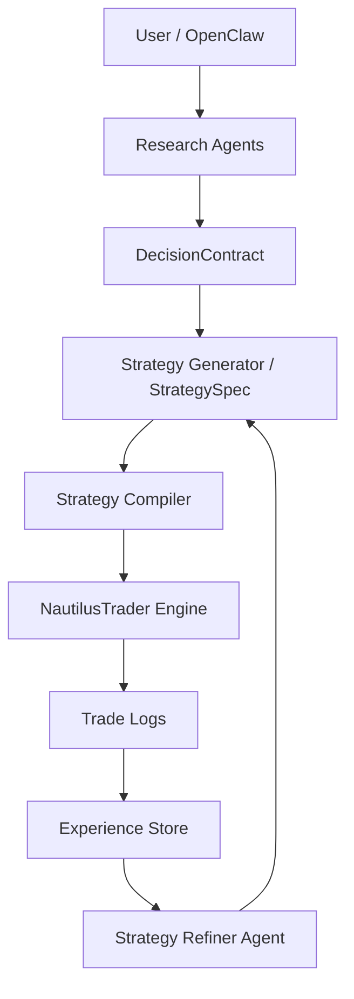
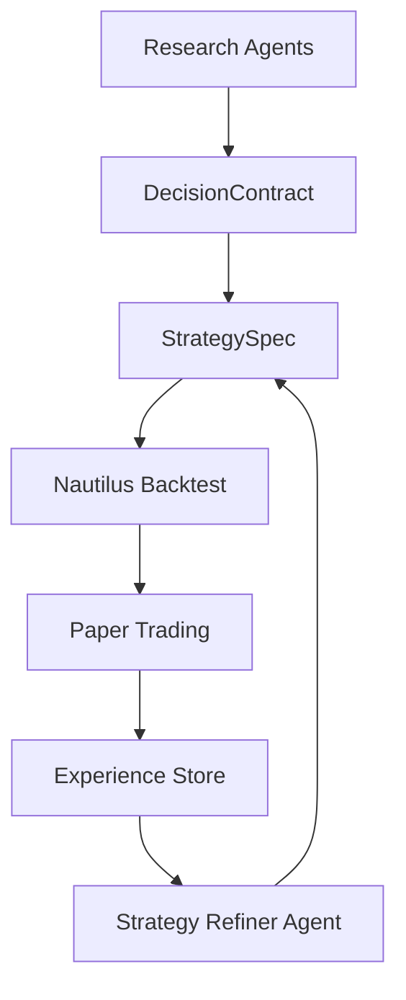
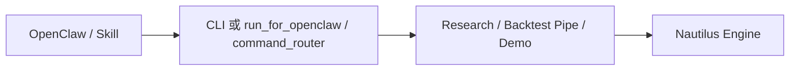

# AI Trading Research System — System Interaction & Agent Loop Design

## 文档目的

本文件补充 **User Journey 文档**，重点说明两件事：

1. 系统各组件之间如何交互（System Interaction）
2. AI 如何通过经验不断改进策略（Agent Loop / Strategy Evolution）

该文档用于指导：

- 架构设计
- Agent 设计
- Pipeline 设计
- Experience Store 设计
- OpenClaw 集成设计

---

# 一、系统整体交互结构

系统由五个主要层组成：

Research Layer  
Decision Layer  
Strategy Layer  
Execution Layer  
Learning Layer  



---

# 二、系统模块职责

## Research Layer

负责市场研究与信息整合。

主要 Agent：

- News Agent
- Fundamental Agent
- Technical Agent
- Bull Thesis Agent
- Bear Thesis Agent
- Uncertainty Agent

输出：

DecisionContract

---

## Decision Layer

负责把研究结果结构化。

核心对象：

DecisionContract

包含：

- thesis
- supporting_evidence
- counter_evidence
- uncertainties
- confidence
- suggested_action

---

## Strategy Layer

负责把研究结论转化为可执行策略。

StrategySpec（entry_logic、exit_logic、risk_control、position_size、regime_tag）→ StrategyCompiler → NautilusTrader Strategy。

---

## Execution Layer

由 **NautilusTrader** 负责。

Nautilus 提供：market data replay、order lifecycle、portfolio management、exchange adapter（含 Live/IBKR）。

---

## Learning Layer

负责长期经验积累。

完整记录 strategy_run、backtest_result、trade_experience、regime_context；经验驱动策略优化与下一轮研究注入。

---

# 三、Agent Loop（策略进化循环）

系统核心目标是实现：**AI 自动改进策略**。



---

# 四、策略进化逻辑

每一轮循环包含：1. 市场研究 2. 策略生成（StrategySpec）3. 回测验证 4. Paper Trading 5. 经验记录 6. 策略优化（Strategy Refiner）。

```
Iteration 1  Research → Contract → StrategySpec → Backtest → Store
Iteration 2  StrategyRefiner → New Strategy → Backtest
Iteration 3  Paper → Store；经验注入与 Refinement
```

---

# 五、Experience Store 设计

Experience Store 用于保存策略表现。表结构包含 strategy_run、backtest_result、trade_experience（entry_condition、exit_condition、market_regime、outcome）、experience_summary 等。

---

# 六、OpenClaw 与系统交互

OpenClaw 作为系统控制入口。通过 **CLI**（`cli.py`）或 **run_for_openclaw.py** 调用；control 层提供 **command_router**（意图→子命令）、**skill_interface**（执行并返回 JSON 报告）。



OpenClaw 可执行：

- **research**：`cli.py research` 或 `run_for_openclaw.py research`
- **backtest**：`cli.py backtest` 或 `run_for_openclaw.py backtest`
- **demo**：`cli.py demo` 或 `run_for_openclaw.py demo`（E2E 四块）
- **paper**：`cli.py paper --symbol SYMBOL`（默认 Nautilus 短窗口回测）
- **schedule_tasks**：`run_scheduled.py [--once]`，报告落盘至 REPORT_DIR

---

# 七、未来扩展方向

未来系统可以扩展：

Multi‑Asset Support  
Crypto / Futures / Options

Multi‑Agent Research  
多个 AI 研究角色

Reinforcement Learning  
策略强化学习

Autonomous Strategy Evolution  
完全自动策略迭代

---

# 八、总结

Research → Decision → StrategySpec → Backtest → Paper → Experience → Strategy Evolution。AI 负责研究、策略设计与经验学习。
