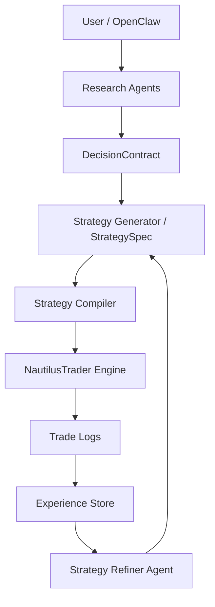
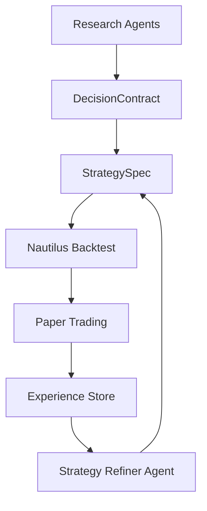

# Agent Loop & System Interaction（目标架构）

说明系统组件如何交互、AI 如何通过经验改进策略。与 [user_journey.md](user_journey.md) 互补；架构总览见 [system_architecture_overview.md](system_architecture_overview.md)。

---

## 五层交互结构

---

## 各层职责

- **Research Layer**：市场研究，产出 **DecisionContract**
- **Decision Layer**：研究结果结构化（thesis、evidence、confidence、suggested_action）
- **Strategy Layer**：StrategySpec → StrategyCompiler → NautilusTrader Strategy
- **Execution Layer**：NautilusTrader（回测 / Paper / Live）
- **Learning Layer**：ExperienceStore（strategy_run、backtest_result、trade_experience、experience_summary）；经验驱动策略优化

---

## Agent Loop（策略进化）

每一轮：研究 → 策略生成 → 回测 → Paper → 经验记录 → Strategy Refiner → 新策略。

---

## OpenClaw 入口

通过 CLI 或 run_for_openclaw；command_router、skill_interface 提供统一入口。详见 [../integration/openclaw_integration.md](../integration/openclaw_integration.md)。
