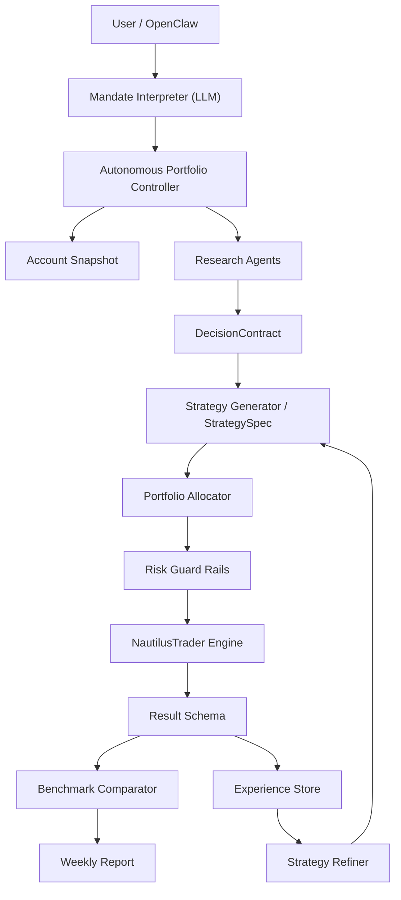

# System Architecture Overview（目标架构）

本文定义 AI Trading Research System 的**目标架构**，仅描述最终形态。

**目标**：对齐 Research / Strategy / Execution 层；定义 Portfolio 自主控制；集成 Experience 学习闭环；为开发提供稳定架构参考。

**原则**：
1. LLM 负责研究、推理与策略进化
2. 确定性服务控制账户、风险限额与执行
3. NautilusTrader 提供统一交易引擎

---

## 高层架构（Mermaid）

---

## 核心术语（统一）

| 术语 | 说明 |
|------|------|
| **DecisionContract** | 单次研究输出，结构化契约 |
| **StrategySpec** | 可复现策略规则，由 Strategy Generator 产出 |
| **ResultSchema** | 统一结果模型（CLI/OpenClaw 输出） |
| **ExperienceStore** | 策略运行、回测、交易经验存储 |
| **PortfolioController** | 自主组合控制器（目标架构） |
| **TradingMandate** | 用户意图的结构化表示（目标架构） |
| **AccountSnapshot** | 账户状态快照（现金、持仓、风险预算） |

---

## 层级简述

1. **User / OpenClaw** — 系统入口
2. **Mandate Interpreter (LLM)** — 自然语言 → TradingMandate
3. **Autonomous Portfolio Controller** — 协调研究、策略、执行与报告
4. **Account Snapshot** — 账户一致视图
5. **Research Layer** — 产出 DecisionContract
6. **Strategy Layer** — StrategySpec、Strategy Refiner、Strategy Compiler
7. **Portfolio Allocator** — 目标仓位与限额
8. **Risk Guard Rails** — 硬性风控约束
9. **NautilusTrader Engine** — 回测 / Paper / Live
10. **Result Schema** — 统一结果格式
11. **Benchmark Comparator** — 相对基准表现
12. **Experience Store** — 学习数据持久化
13. **Strategy Refiner** — 经验驱动策略进化

详见 [agent_loop.md](agent_loop.md)、[user_journey.md](user_journey.md)。
