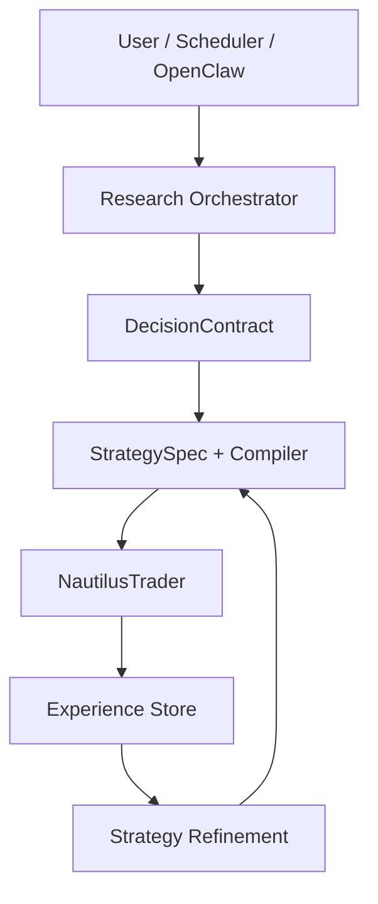

# User Journey & Use Cases（目标架构）

梳理核心用户场景与完整用户旅程。架构总览见 [../system_architecture.md](../system_architecture.md)，Agent 循环见 [Agent_Loop_and_Interaction.md](Agent_Loop_and_Interaction.md)。

---

## 系统角色

- 开发者、研究员、交易员、自动运行系统（Scheduler）、AI Agents（Research / Strategy / Experience）

---

## User Case 列表

| UC | 名称 |
|----|------|
| UC-01 | 第一次运行系统（First Demo） |
| UC-02 | AI 研究股票 |
| UC-03 | 研究转策略（Research → Strategy） |
| UC-04 | 策略回测（Backtest） |
| UC-05 | Paper Trading |
| UC-06 | OpenClaw 调用系统 |
| UC-07 | 定时自动运行 |
| UC-08 | 经验学习与策略进化 |

---

## 核心用例摘要

- **UC-01**：`python cli.py demo NVDA --mock` → 四块输出（研究结论、策略生成、回测结果、交易总结）；流程：Research → DecisionContract → Strategy → Backtest → ExperienceStore → Summary。
- **UC-04**：`python cli.py backtest NVDA` → Research → Contract → Strategy → NautilusTrader Backtest → ExperienceStore；输出见 **ResultSchema**。
- **UC-06**：CLI 或 `run_for_openclaw.py`；报告格式见 [../core_concepts.md](../core_concepts.md)。

---

## 完整 User Journey（目标态）

