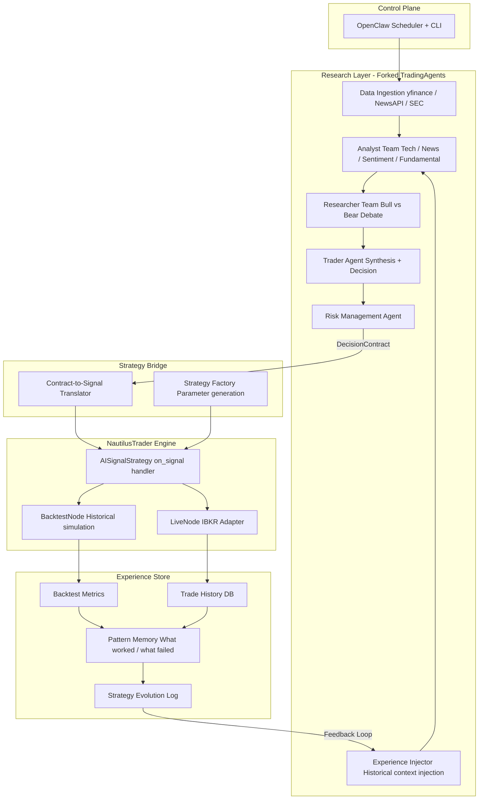
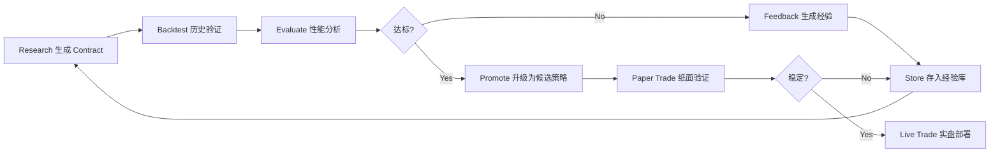

# 项目重构方案：NautilusTrader + 经验闭环

本文档描述将 AI Trading Research System 从 MVP skeleton 升级为「复用 NautilusTrader、发挥 TradingAgents 主动研究、基于回测结果累积经验并迭代决策信号、最终支持全自动实盘」的完整方案。

---

## 1. 目标与原则

- **复用成熟回测工具**：以 NautilusTrader 作为回测与实盘统一引擎，保证 backtest-live parity。
- **发挥 TradingAgents 主动研究**：Fork TradingAgents，深度定制 Analyst/Researcher/Trader，输出结构化 DecisionContract。
- **经验累积与迭代**：回测/实盘结果写入 Experience Store，下一轮研究注入历史经验，持续优化决策信号。
- **多市场**：先美股（yfinance + IBKR），架构预留 A 股/加密货币扩展。

---

## 2. 目标架构



**核心闭环**：Research → DecisionContract → NautilusTrader 回测/实盘 → 结果写入 Experience Store → 反馈注入下一轮 Research → 信号持续迭代。

---

## 3. 目录结构（目标）

```text
ai-trading-research-system/
├── libs/
│   └── tradingagents/              # Fork 的 TradingAgents（git submodule）
├── src/
│   └── ai_trading_research_system/
│       ├── config/                 # 保留，扩展多环境配置
│       ├── data/                   # 重构：真实数据源 + Nautilus DataCatalog
│       │   ├── providers.py        # yfinance / AkShare / NewsAPI 适配
│       │   ├── catalog.py          # ParquetDataCatalog 管理
│       │   └── models.py          # 保留 + 扩展
│       ├── research/               # 重构：桥接 forked TradingAgents
│       │   ├── orchestrator.py     # 调用 TradingAgents graph
│       │   ├── schemas.py          # DecisionContract（增强版）
│       │   └── experience_ctx.py   # 经验注入上下文构建
│       ├── strategy/               # 新增：NautilusTrader 策略层
│       │   ├── ai_signal.py        # AISignalStrategy(Strategy)
│       │   ├── translator.py       # DecisionContract → Nautilus 信号
│       │   └── factory.py          # 策略参数工厂
│       ├── backtest/               # 新增：回测集成
│       │   ├── runner.py           # BacktestNode 封装
│       │   ├── evaluator.py        # 性能指标提取
│       │   └── configs.py          # 回测场景配置
│       ├── experience/             # 新增：经验累积
│       │   ├── store.py            # 经验数据库（SQLite → PostgreSQL）
│       │   ├── analyzer.py         # 历史表现分析
│       │   └── feedback.py         # 生成反馈 prompt
│       ├── execution/              # 重构：基于 Nautilus 的实盘
│       │   ├── live_runner.py     # TradingNode 封装
│       │   └── adapters.py         # IBKR 适配器配置
│       ├── pipeline/               # 新增：端到端编排
│       │   ├── research_pipe.py    # Research → Contract
│       │   ├── backtest_pipe.py    # Contract → Backtest → Experience
│       │   └── live_pipe.py        # Contract → Live Execution
│       └── utils/                  # 保留
├── docs/
├── scripts/
└── tests/
```

---

## 4. 现有模块处理方式

| 现有文件 | 处理方式 |
|---------|---------|
| `research/agents/*`（7 个 mock agent） | 删除，由 forked TradingAgents 替代 |
| `research/orchestrator.py` | 重写，变为 TradingAgents graph 的调用入口 |
| `research/schemas.py` | 保留并增强 DecisionContract（strategy_params、backtest_reference、experience_basis） |
| `decision/rules.py` | 合并到 `strategy/translator.py`，规则逻辑嵌入 Nautilus 策略 |
| `portfolio/engine.py` | 删除，由 NautilusTrader 内置 Portfolio 替代 |
| `execution/paper.py` | 删除，由 NautilusTrader BacktestNode 替代 |
| `data/providers.py` | 重写，接入 yfinance / AkShare + Nautilus DataCatalog |
| `config/settings.py` | 保留并扩展（Nautilus/IBKR/LLM 配置） |

---

## 5. 分阶段实施

### Phase 1：基础重构与依赖搭建（约 1–2 周）

- 新增目录结构；引入 NautilusTrader、yfinance、LangChain/LangGraph、OpenAI 等依赖。
- TradingAgents 以 `libs/tradingagents` 作为 git submodule，editable install。
- 验收：`pip install -e .` 成功，Nautilus 与 TradingAgents 可 import。

### Phase 2：TradingAgents Fork 集成与真实数据（约 2–3 周）

- Fork TradingAgents，定制 Analyst/Researcher/Trader 输出与数据源。
- ResearchOrchestrator 调用 TradingAgents graph，并注入 Experience Store 上下文。
- 增强 DecisionContract（strategy_params、backtest_reference、experience_basis）。
- 验收：对指定标的运行完整研究流程，输出真实 DecisionContract。

### Phase 3：NautilusTrader 回测集成（约 2–3 周）

- 实现 AISignalStrategy（on_signal 接收 AI 信号）、Contract-to-Signal Translator、BacktestRunner。
- 历史数据写入 ParquetDataCatalog，回测输出 Sharpe、最大回撤、胜率等指标。
- 验收：Contract → 回测 → 得到可复现的性能指标。

### Phase 4：经验累积与迭代闭环（约 2–3 周）

- Experience Store 数据模型与表结构见 [experience_schema.md](experience_schema.md)；实现 FeedbackGenerator、ExperienceInjector。
- 回测/实盘结果写入 Store，下一轮 Research 前注入「相似历史 + 经验总结」。
- 验收：多轮迭代后，可观察到信号质量或回测指标的变化。

### Phase 5：实盘就绪（约 2–4 周）

- Circuit Breaker、仓位/回撤限制、人工干预入口。
- LiveRunner 基于 NautilusTrader TradingNode + IBKR 适配器。
- 策略上线前需通过 [live_readiness_checklist.md](live_readiness_checklist.md)。
- 验收：IBKR Paper Trading 稳定运行至少 1 周。

---

## 6. 经验闭环调度逻辑



---

## 7. 与 AGENTS.md 的对应关系

| AGENTS.md 中的角色 | 在新架构中的对应 |
|-------------------|-----------------|
| Copilot Agent | OpenClaw CLI + 状态查询接口 |
| Execution Agent | NautilusTrader LiveNode + AISignalStrategy |
| Risk Guard Agent | TradingAgents 内 Risk Management + Nautilus 风控 + Circuit Breaker |
| Ops Agent | 监控 NautilusTrader 事件流 + Experience Store 异常告警 |

---

## 8. 风险与注意事项

- **NautilusTrader 学习曲线**：事件驱动、Rust+Python 混合，需预留调试时间。
- **TradingAgents Fork 维护**：上游更新频繁，需定期 rebase 与回归测试。
- **LLM 成本**：多 Agent 调用 + 迭代回测会放大成本，需控制调用频率与模型选择。
- **经验库冷启动**：初期需通过历史回测「预热」经验库，再依赖反馈迭代。

---

## 9. 参考文档

- **文档索引**：[README.md](README.md)（开发入口）
- 架构：[architecture.md](architecture.md)
- 产品需求：[PRD.md](PRD.md)
- MVP 与节奏：[mvp_plan.md](mvp_plan.md)
- DecisionContract：[decision_contract.md](decision_contract.md)
- StrategySpec：[strategy_spec.md](strategy_spec.md)
- Experience Store 表结构：[experience_schema.md](experience_schema.md)
- 实盘前检查：[live_readiness_checklist.md](live_readiness_checklist.md)
