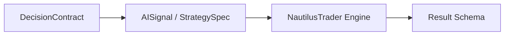

# Execution Flow（目标态）

执行层统一由 NautilusTrader 承载；回测与 Paper 已按此实现，Live 待实盘清单通过后接入。

- **Backtest**：Research → Contract → Translator → run_backtest → ExperienceStore。
- **Paper**：同上，run_paper_simulation（短窗口）。
- **Live**：目标 NautilusTrader LiveNode + IBKR 适配器。

详见 [nautilus_migration.md](nautilus_migration.md)、[../architecture/agent_loop.md](../architecture/agent_loop.md)。
