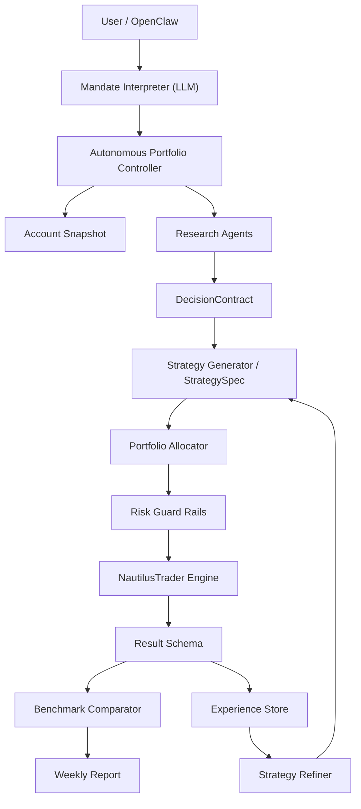

# System Architecture（目标架构）

本文定义 AI Trading Research System 的**目标架构**，仅描述最终形态。

**目标**：对齐 Research / Strategy / Execution 层；定义 Portfolio 自主控制；集成 Experience 学习闭环；为开发提供稳定架构参考。

**原则**：
1. LLM 负责研究、推理与策略进化
2. 确定性服务控制账户、风险限额与执行
3. NautilusTrader 提供统一交易引擎

---

## 高层架构（Mermaid）

---

## 核心术语（统一）

| 术语 | 说明 |
|------|------|
| **DecisionContract** | 单次研究输出，结构化契约 |
| **StrategySpec** | 可复现策略规则，由 Strategy Generator 产出 |
| **ResultSchema** | 统一结果模型（CLI/OpenClaw 输出） |
| **ExperienceStore** | 策略运行、回测、交易经验存储 |
| **PortfolioController** | 自主组合控制器（目标架构） |
| **TradingMandate** | 用户意图的结构化表示（目标架构） |
| **AccountSnapshot** | 账户状态快照（现金、持仓、风险预算） |

---

## 入口与控制面（当前实现）

**唯一业务入口**：`application.commands`。CLI 与 OpenClaw 均通过 `application.command_registry` 调用，禁止直接调用 pipeline。

- **OpenClaw agent 主入口（单周期 paper）**：`autonomous_paper_cycle`。Agent 只需调用此命令即可完成：读组合快照 → 研究/打分 → 规则/风控 → 最终决策 → 订单意图（可选执行）→ **全部落盘**（`runs/<run_id>/`）。输入/输出契约见 `openclaw/contract.AutonomousPaperCycleInput/Output`；实现见 `pipeline/autonomous_paper_cycle.run_autonomous_paper_cycle`。
- **命令元数据 Single Source of Truth**：`openclaw/registry.py`。维护所有命令的 canonical、aliases、description、input/output schema、example、handler_target、expose_for_openclaw。alias→canonical 解析**仅在此实现**；`command_registry` 仅从 registry 读取并绑定 handler，CLI 与 run_for_openclaw 不维护命令/别名表。
- **Canonical commands**：`research_symbol`、`backtest_symbol`、`run_demo`、`run_paper`、`autonomous_paper_cycle`、`weekly_autonomous_paper`、`weekly_report`。**Aliases**：`research`、`backtest`、`demo`、`paper`、`paper-cycle`/`paper_cycle`、`weekly-paper`（`weekly_report` 无别名）。
- **CLI**：`presentation/cli.py` 仅做：解析参数 → `command_registry.run` → `renderers.render`。不包含业务逻辑、不调用 pipeline。`paper-cycle` 子命令对应 `autonomous_paper_cycle`。
- **OpenClaw**：`scripts/run_for_openclaw.py` 从 `openclaw.registry.get_skill_names()` 取 skill 列表（仅 expose_for_openclaw=True），经 `command_registry.run` 执行，由 `openclaw.adapter.format_result` 转 JSON。契约见 `openclaw/contract.py`；技能注册见 `openclaw/registry.py`。调用示例：`python scripts/run_for_openclaw.py autonomous_paper_cycle NVDA --mock --run_id my_run`。
- **control/**：**已删除**。入口仅为 command_registry + openclaw.adapter。
- **UC-09**：`pipeline/weekly_paper_pipe` 仅做编排（mandate → snapshot → research → allocation → execution）；benchmark、report、summary 由 `services/weekly_finish_service` 等完成。单周期 agent 走 `autonomous_paper_cycle`，不直接调 weekly_paper_pipe。
- **Paper 收敛**：单标的 `run_paper`（CLI `paper`）在非 IBKR 路径下**复用** `run_autonomous_paper_cycle`，状态与审计写入 `runs/`；IBKR 路径仍为兼容层（paper_pipe + place_market_buy）。

## 数据与状态落盘（runs/）

- **统一数据访问**：`state.RunStore`。禁止各 service 随手读写 run 相关文件；所有 run metadata、snapshot、decision、order_intents、paper execution、audit 经 RunStore 读写。
- **目录布局**（默认根目录 `runs/`，可环境变量 `PAPER_RUNS_ROOT` 覆盖）：
  - `runs/<run_id>/meta.json` — 本轮 run_id、mode、symbols、config、started_at、ended_at
  - `runs/<run_id>/snapshots/portfolio_before.json`、`portfolio_after.json`、`research.json`
  - `runs/<run_id>/artifacts/candidate_decision.json`、`final_decision.json`、`order_intents.json`
  - `runs/<run_id>/execution/paper_result.json`
  - `runs/<run_id>/audit.json` — 追加型审计列表
- **最小 replay**：`RunStore.read_run_summary(run_id)` 可基于某次 run 的落盘结果做复盘/重建 summary。

---

## 层级简述

1. **User / OpenClaw** — 系统入口
2. **Mandate Interpreter (LLM)** — 自然语言 → TradingMandate
3. **Autonomous Portfolio Controller** — 协调研究、策略、执行与报告
4. **Account Snapshot** — 账户一致视图
5. **Research Layer** — 产出 DecisionContract
6. **Strategy Layer** — StrategySpec、Strategy Refiner、Strategy Compiler
7. **Portfolio Allocator** — 目标仓位与限额
8. **Risk Guard Rails** — 硬性风控约束
9. **NautilusTrader Engine** — 回测 / Paper / Live
10. **Result Schema** — 统一结果格式
11. **Benchmark Comparator** — 相对基准表现
12. **Experience Store** — 学习数据持久化
13. **Strategy Refiner** — 经验驱动策略进化

详见 [archive/Agent_Loop_and_Interaction.md](archive/Agent_Loop_and_Interaction.md)、[archive/User_Journey.md](archive/User_Journey.md)。
